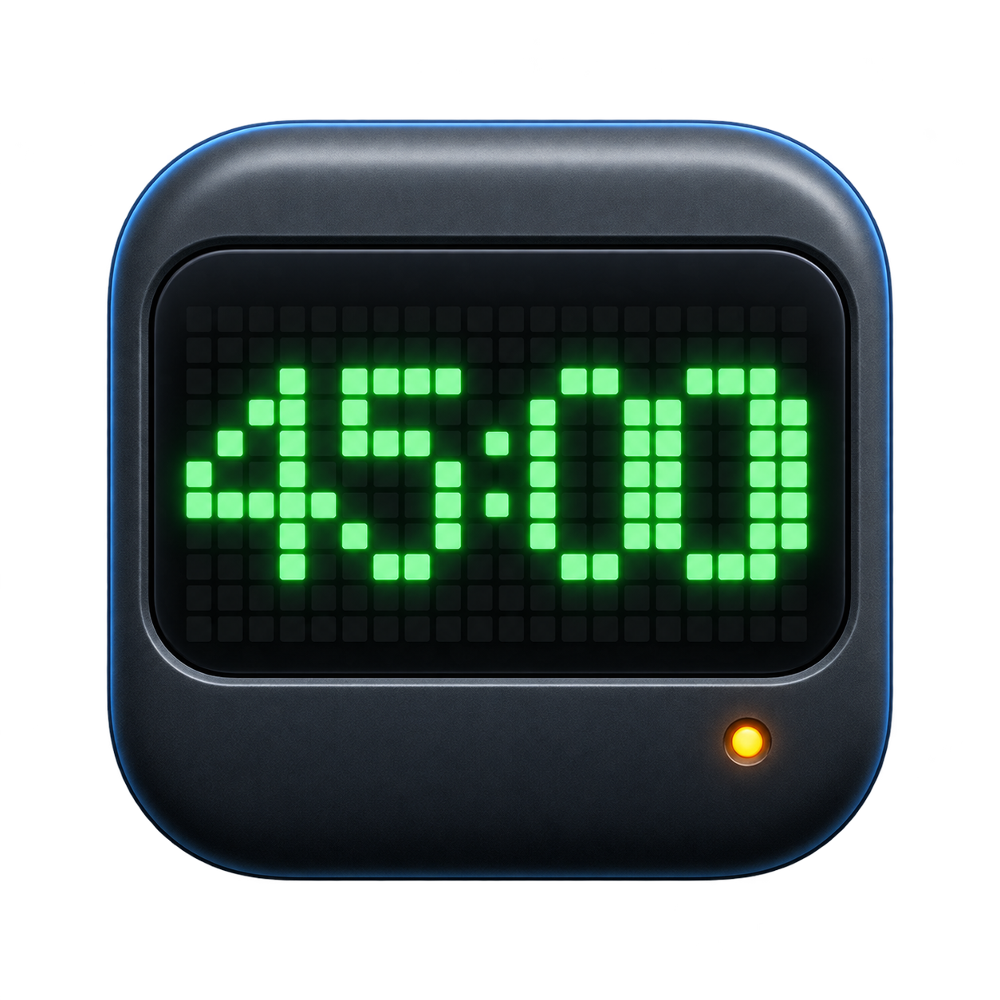

<p align="center">
  
</p>

<h1 align="center">Ulanzi TC002 Focus Clock</h1>

<p align="center">
  <strong>把 Ulanzi TC002 变成一只真正连接工作节奏的桌面专注时钟。</strong><br>
  macOS 一键部署 · Lark 系统状态同步 · 临时运行不刷固件
</p>

<p align="center">
  <a href="https://github.com/Pimmpimmm/ulanzi-tc002-focus-clock/actions/workflows/portability.yml"></a>
  
  
  
</p>

<p align="center">
  
</p>

这是一个给 Ulanzi TC002 使用的 Focus / Rest 专注时钟，并把当前用户的
Lark“专注中”系统状态同步出去。默认是专注 45 分钟、休息 5 分钟，但每个人
都可以在助手安装/配对时自定义时长。

运行时直接调用 Lark Personal Settings API，不创建或删除日历日程。

## 界面与视觉

- macOS GUI 使用原生状态卡片和四步引导，环境、Lark、TC002、电脑助手是否就绪一眼可见；
- GUI 默认跟随 macOS 外观，也可在固定玻璃控制栏切换浅色/深色；2×2 系统状态始终固定可见，浅色采用蓝/青色降低刺激感，主要操作、警告和运行状态同时使用文字、图标与语义色；
- TC002 专注阶段保持绿色，休息阶段保持蓝色，最后 30 秒不会突然变红；
- 专注结束显示蓝色 `GO REST`，休息结束显示绿色 `GO WORK`，内容左右对称并尽量铺满 52×16 点阵；
- macOS App 已包含专用图标，并提供 Intel 与 Apple Silicon 通用构建。

## 为什么值得用

| 能力 | 体验 |
| --- | --- |
| 一键部署 | 新 Mac 从 GitHub 冷克隆后，预演、安装、测试和构建 GUI 都有现成入口 |
| 真实硬件 | TC002 负责桌面显示、按键和本地计时，电脑只提供同步服务 |
| Lark 原生状态 | 专注开始/提前退出分别调用系统状态 `batch_open` / `batch_close` |
| 安全边界 | Secret、Token 和共享密钥只进 macOS 钥匙串，不写入仓库或 MQTT |
| 可回滚 | 临时运行包写入设备可写目录，重启 TC002 即恢复原生界面 |

## 60 秒了解架构

```text
TC002 Focus Clock ── MQTT ──> 本机 EMQX ──> Focus bridge ──> 当前用户 Lark
       │                                             │
       └── 本地显示、按键、计时                         └── Personal Settings API
```

## 工作方式

每个人的电脑单独运行一套后台助手：

```text
TC002 时钟
   ↓ MQTT
本机 EMQX（每个人自己的电脑）
   ↓
本机 Focus bridge
   ↓
当前用户自己的 Lark 账号
```

电脑助手会在登录后自动启动 EMQX、MQTT adapter 和 Lark bridge。Lark Token、
App Secret 和共享密钥只写入当前用户的 macOS 钥匙串，不写进仓库、设备镜像
或 MQTT 消息。

## 先看这几份说明

- [macOS 统一 GUI 入口](mac-app/README.md)
- [macOS 助手完整安装步骤](companion/README.md)
- [TC002 设备端说明](device/TC002_Focus_Probe/README_FOCUS.md)
- [交给其他 Agent 执行下载/安装的提示词](AGENT_DOWNLOAD_PROMPT.md)

## 给 AI Agent 的一键配置提示词

在新 Mac 上，可以把下面这段直接发给支持执行终端命令的 AI Agent。它会先下载
最新代码、预演环境检查，再安装依赖、构建并打开 GUI；Lark OAuth 和 TC002 的
Wi-Fi ADB 配对仍由用户本人确认，凭据不会写入仓库：

如果 Agent 的沙箱没有网络或主目录写入权限，不要让它反复申请下载。直接由用户在
macOS“终端”运行下面这一条命令；它不依赖 Git，会从公开 GitHub 仓库下载、校验、
安装依赖并打开 App：

```bash
curl -fsSL --retry 3 https://raw.githubusercontent.com/Pimmpimmm/ulanzi-tc002-focus-clock/main/install-from-github.sh | /bin/bash -s -- --apply
```

默认安装到 `~/ulanzi-tc002-focus-clock`。如果该目录已经存在，安装器会停止而不是
覆盖；确认需要更新时可在末尾追加 `--replace`，旧目录会改名保留为备份。
若自动下载失败，安装器会尝试在浏览器打开项目的
[GitHub ZIP 下载地址](https://github.com/Pimmpimmm/ulanzi-tc002-focus-clock/archive/refs/heads/main.zip)。
如果连最初的 `raw.githubusercontent.com` 脚本都无法取得，安装器无法运行；此时由
Agent 打开上面的地址，或由用户在浏览器下载 ZIP。解压后进入项目目录运行
`bash bootstrap-macos.sh --apply`。缺少 Homebrew 或命令行工具时，脚本会打开对应
官方页面；浏览器也被沙箱限制时会打印地址供复制。

```text
请把 Ulanzi TC002 Focus Clock 部署到这台 macOS 电脑。先检查 macOS 13+、
Homebrew 和 Apple Command Line Tools，然后优先执行这一条公开仓库安装命令：
`curl -fsSL --retry 3 https://raw.githubusercontent.com/Pimmpimmm/ulanzi-tc002-focus-clock/main/install-from-github.sh | /bin/bash -s -- --apply`。
如果你的沙箱不允许联网或写入 `$HOME`，不要反复重试；把该命令原样给我，让我在
macOS“终端”中执行；也可以打开项目 GitHub ZIP 下载地址让我在浏览器下载。完成后
你再从 `~/ulanzi-tc002-focus-clock` 或解压目录继续验收。
不要刷写 update.img、不要修改 /res、不要
把 Lark Secret/Token 写入文件或发到聊天里。打开生成的 TC002FocusCompanion.app，
让我在 GUI 中输入 TC002 的 Wi-Fi ADB 地址和自己的 Lark App 信息，并在浏览器
完成 OAuth；然后点击“启动专注时钟”。最后运行测试和 bundle 校验，确认 EMQX、
Lark bridge、MQTT adapter、ADB 和 Lark 系统状态都正常，并只报告结果和仍需我
手动完成的步骤。完整流程和 GUI 不可用时的 CLI 备用命令见
`AGENT_DOWNLOAD_PROMPT.md`。
```

完整、可复制的 Agent 流程（含权限、网络、错误码和安全边界）见
[AGENT_DOWNLOAD_PROMPT.md](AGENT_DOWNLOAD_PROMPT.md)。

## 新 Mac 推荐入口

先安装 [Homebrew](https://brew.sh) 和 Apple 命令行工具（`xcode-select --install`），
然后直接运行上面的一键下载命令。也可以手动克隆仓库，在 Finder 中双击
`一键准备TC002.command`，或在仓库内运行：

```bash
bash bootstrap-macos.sh --apply
```

该入口会安装/升级 Node.js、EMQX 和 ADB，执行自动测试与发布包校验，
构建并打开 TC002 Focus Companion。用户只需在 App 内完成 Lark 授权、
填写设备 IP 并点击“启动专注时钟”。Lark 授权必须由用户本人在浏览器确认。

刚下载并打开 App 时显示“待首次启动”是正常状态，不代表安装失败。此时尚未创建
LaunchAgent；完成 Lark 授权并点击“启动专注时钟”后，EMQX、Lark bridge 和
MQTT adapter 才会安装并变为“助手运行中”。

App 启动时会自动检查环境；已经保存时钟/电脑 IP 时自动测试 TC002，钥匙串中已有
Lark 授权时自动验证系统状态。已有配置全部通过后四个状态格都会变绿，第 4 格显示
“可以启动”，这时只需点击一次“启动专注时钟”。缺少配置的项目不会被自动修改。

GUI 的“更换提示音”可以选择本机 MP3（不超过 20 MB）。文件只保存在当前用户的
App 支持目录，不会写入项目、Git 或固件；点击“启动专注时钟”时才会同步到设备的
临时运行目录。选择“恢复默认”后，下次启动会重新使用内置提示音。

当前安全部署模式为临时部署：不刷固件，TC002 重启后恢复原生界面。
新设备需要先在设备上开启 Wi-Fi ADB。

首次使用前，还要在 Lark 开放平台的自建应用中配置 OAuth 回调地址
`http://127.0.0.1:8788/oauth/callback`，开通系统状态相关 API 权限（获取、创建、批量开启、批量关闭），并发布应用版本、确认当前租户可用。GUI 会在授权后自动复用或创建“专注中”状态，不需要创建日历。

## 手动安装（排查时使用）

### 1. 安装依赖

```bash
brew install node emqx
node --version     # 需要 24 或更高版本
```

EMQX 的 macOS 安装包由 Homebrew 提供。不要使用 Linux 的
`emqx-*-amzn2023-amd64` 压缩包。

当前 Homebrew 公式页面显示的是 EMQX 5.8.8，并标记 2026-11-30 停止维护；
这份项目先按小规模内网试用配置。长期正式运行前，应评估升级到 EMQX 官方
仍维护的 macOS 版本或使用 Enterprise macOS ZIP。

### 2. 获取代码

```bash
git clone https://github.com/Pimmpimmm/ulanzi-tc002-focus-clock.git
cd ulanzi-tc002-focus-clock
npm ci
```

### 3. 登录自己的 Lark

```bash
bash bridge/setup-lark-oauth.sh
```

浏览器授权成功后，Token 会写入本机钥匙串。

如果回调页面显示 `Authorization failed`，先查看 GUI 日志或终端错误码：

- `99991672` 表示应用还没有申请对应的 API 权限；开通并发布系统状态权限后重新授权；
- 浏览器已经显示成功、但 GUI 仍停在“正在打开 Lark 授权页面”时，关闭旧版 App，重新打开最新构建。新版会主动关闭浏览器 keep-alive 连接并完成收尾；
- Finder 启动 App 时不会读取终端 `.zshrc`。GUI 会自动识别 Homebrew、`~/.local`、nvm、fnm、Volta 和 mise 中的 Node.js。

### 4. 预演助手安装

先查本机局域网地址，例如：

```bash
ipconfig getifaddr en0
```

再预演（把地址替换成实际值）：

```bash
bash companion/install-macos.sh \
  --lan-host 192.0.2.100 \
  --mode real \
  --focus-seconds 2700 \
  --rest-seconds 300
```

预演只打印计划，不会安装服务。

### 5. 正式安装

确认预演地址正确后：

```bash
bash companion/install-macos.sh \
  --lan-host 192.0.2.100 \
  --mode real \
  --focus-seconds 2700 \
  --rest-seconds 300 \
  --apply
```

安装后会自动加载：

- `com.tc002.focus-emqx`
- `com.tc002.focus-bridge`
- `com.tc002.focus-mqtt`

### 6. 配对时钟

确保时钟已经打开 Wi-Fi ADB，然后把电脑地址写入时钟的可写运行目录：

```bash
npm run companion:configure-device -- \
  --adb-target 192.0.2.131:5555 \
  --lan-host 192.0.2.100 \
  --focus-seconds 2700 \
  --rest-seconds 300
```

这里的 `--adb-target` 是时钟地址，`--lan-host` 是电脑地址。这个动作只写
`device.conf`，不改 `/res`，不刷 `update.img`。临时运行在 `/tmp/ui` 时，
追加 `--remote-dir /tmp/ui`。

### 7. 验证

按中键进入 Focus，确认 Lark 出现“专注中”系统状态；提前退出，确认状态
被关闭。修改时长后重新运行 `configure-device.sh`，再重启时钟应用，新的
专注/休息时长就会生效。关闭电脑后，时钟本地计时和声音仍应继续工作。

日志目录：

```bash
tail -f "$HOME/Library/Logs/tc002-focus-companion/emqx.log"
tail -f "$HOME/Library/Logs/tc002-focus-bridge/bridge.log"
tail -f "$HOME/Library/Logs/tc002-focus-bridge/mqtt.log"
```

## 暂停电脑助手

```bash
launchctl unload "$HOME/Library/LaunchAgents/com.tc002.focus-emqx.plist"
launchctl unload "$HOME/Library/LaunchAgents/com.tc002.focus-bridge.plist"
launchctl unload "$HOME/Library/LaunchAgents/com.tc002.focus-mqtt.plist"
```

这不会改动时钟固件。当前设备的自动启动入口仍需单独验证，日常使用不要
刷写 `update.img`。

## 当前限制

- 每台电脑一套本机 EMQX，适合人数少、时钟和电脑在同一局域网的场景；
- 电脑关机时，时钟本地功能继续运行，但 Lark 不会即时同步；
- 当前第一版仍使用固定 MQTT 主题，同一台电脑挂多台时钟需要后续增加设备
  序列号配对；
- 正式批量部署前，还应给 EMQX 增加用户名、密码和 ACL。目前版本按可信局域网
  使用，Lark 凭据本身仍受 macOS 钥匙串保护。

## 代码目录

```text
bridge/       Lark OAuth、系统状态机和 MQTT adapter
companion/    macOS 本机 EMQX 与后台服务安装器
device/       TC002 FlyThings 应用与设备端 MQTT 配置读取
probes/       MQTT、Lark 和安全性测试
research/     方案、协议和验证记录
```
